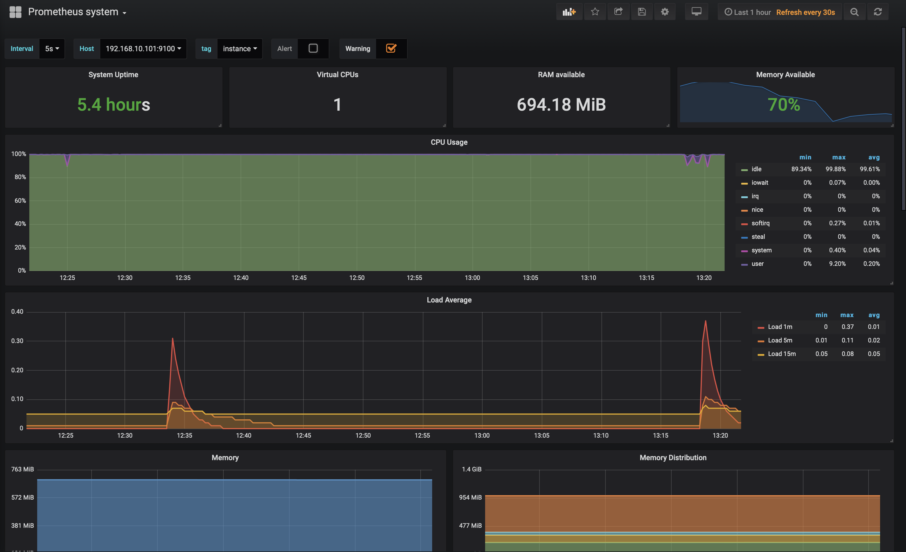

## **Project goal:**

- Automatic deployment of Dockerized Application with basic monitoring.
- Automatically collected metrics from containers via Prometheus (exporters) and cAdvisor.
- Visualization of metrics using Grafana platforms.


**Used tools:** ***[Vargrant](https://www.vagrantup.com/docs/), [Ansible](https://docs.ansible.com/ansible/2.4/intro.html), [Docker](https://docs.docker.com), [Prometheus](https://prometheus.io/docs/introduction/overview/), [Grafana](http://docs.grafana.org), [cAdvisor](https://github.com/google/cadvisor), [Node_exporter](https://github.com/prometheus/node_exporter)***

***

**Use cases**

**TO DO**

***

**Prerequisites:**

You must have installed:

1. Vagrant tool made by *Hashi Corp*
2. Virtual Box 
3. Ansible
4. Mail account

* Vagrant is a tool for building and managing virtual machine environments in a single workflow. With an easy-to-use workflow and focus on automation, Vagrant lowers development environment setup time, increases production parity, and makes the "works on my machine" excuse a relic of the past. https://www.vagrantup.com/
  
* VirtualBox is a powerful x86 and AMD64/Intel64 virtualization product for enterprise as well as home use. https://www.virtualbox.org/

* Ansible is an IT automation tool. It can configure systems, deploy software, and orchestrate more advanced IT tasks such as continuous deployments or zero downtime rolling updates.


***
**Instalation:**


1. mkdir /*your_path*/*project01*; cd /*your_path*/*project01**
2. git init
3. git clone https://github.com/doriandinhxuan/Ghost-Application-with-basic-monitoring.git
4. cd host-Application-with-basic-monitoring
5. vagrant up 

Access to Grafana Interface :

| Username | Password | Port |
|----------|----------|------|
| admin    | test!!   | 3000 |

Access to individual servers: vagrant ssh "name of machine" eg. **vagrant ssh grafana**

Check status of machine: **vagrant status**

All components will automatically deploy like: servers, os, application, and configuration.
Important: Configuration of Grafana - DATASOURCES, DASHBORD will be also implemented.

For more Grafana dashbords go to [here](https://grafana.com/dashboards)

***
**Target configuration:**

The environment consists of 3 virtual machines:

- **1** - server with installed and configured:  Prometheus with Node_exporter.
- **1** - server with installed and configured: Grafana with Node_exporter.
- **1** - server with installed and configured: Docker, Ghost application, Node_exporter and cAdvisor.
  
The assumption of the project is a collection of all metrics from the Machines and docker containers. 


Infrastructure diagram: 


***
**Components:**


* **Grafana** - [ 192.168.100.101:3000 ]


* **Prometheus** -[ 192.168.100.102:9090 ]


* **Ghost Blog** - [ 192.168.100.103 ]
  

* **cAdvisor Interface** - [ 192.168.100.103:8080 ]

***

*Before you run* **vagrant up**


What do you have to do?

1. go to /*your_path*/*project01*/ghost-app-basic-monitoring/roles/ghostApp/files
2. Edit config.production.json
3. Put your email and password

**voilà!**

Now you can run **vagrant up**


**config.production.json** :

```{
  "url": "http://192.168.10.103:80/",
  "server": {
    "port": 2368,
    "host": "0.0.0.0"
  },
  "database": {
    "client": "mysql",
    "connection": {
      "host": "127.0.0.1",
      "user": "root",
      "password": "ghost",
      "database": "ghost-db",
      "port": 3306
    }
  },
  "mail": {
    "transport": "SMTP",
    "options": {
    "service": "Gmail",
    "auth": {
    "user": "<your_mail@gmail.com>",
    "pass": "<your_password>"
      }
    }
  },
  "logging": {
    "level": "info",
      "rotation": {
          "enabled": true
      },
    "transports": [
      "file",
      "stdout"
    ]
},
"process": "systemd",
"paths": {
"contentPath": "/var/lib/ghost/content"
}
}


```


To automatic provision & deploy we are using ***ANSIBLE*** which is a radically simple IT automation engine that automates cloud provisioning, configuration management, application deployment, intra-service orchestration, and many other IT needs.


***
***


**Example in practice:**

Below is a drawing showing mysql dashboard (grafana server - data from Prometheus and cAdvisor : **192.168.100.101.3000**)

***
***

***
***

***
***